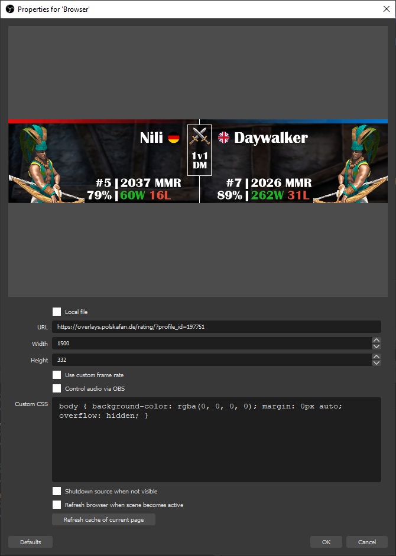

# Setting up the overlay

## 1. Lookup your Steam-ID or Profile-ID

Go to [aoe2.net](https://aoe2.net/#aoe2de-leaderboard-rm-1v1) and search 
for your in-game name `right-click` and click on `Copy link location`. 

You will get something like this:

`javascript:viewProfile('<ID>','<Steam-ID>','<ageofempires.com-Profile-ID>')`

## 2. Use our link

Replace `<Steam-ID>` or `<aoe2.net-Profile-ID>` with the corresponding 
value from the last step as follows:

* With your `Steam-ID`:

  `https://overlays.polskafan.de/rating/?steam_id=<Steam-ID>`

  Example: `https://overlays.polskafan.de/rating/?steam_id=76561197984749679`

* With your `ageofempires.com-Profile-ID`:

  `https://overlays.polskafan.de/rating/?profile_id=<ageofempires.com-Profile-ID>`
  
  Example: `https://overlays.polskafan.de/rating/?profile_id=196240`

## 3. Create a new browser source in OBS

Use this Link and setup a new broweser source in OBS:

The height+width are important because you want to pull in the whole 
overlay and scale it down in your scene.

__NOTE:__ The overlay should be included in an extra in-game scene. 
As it take a bit to load during the beginning of a match to load the
data and create the new image (~5-15 seconds).

## 4. Give us feedback
We are continuously developing this overlay, so let us now what you think
and what for feedback your viewers give you.

## Known issues
### MMR
People tend to criticise the use of `MMR` instead of `ELO`. We use `MMR` on
purpose as we are trying to bring the interface to different games as well as
it's not sure which system Aoe2DE uses. There is no documentation on it so we
would need to assume things we don't want to. So we use the broader term: `MMR`

